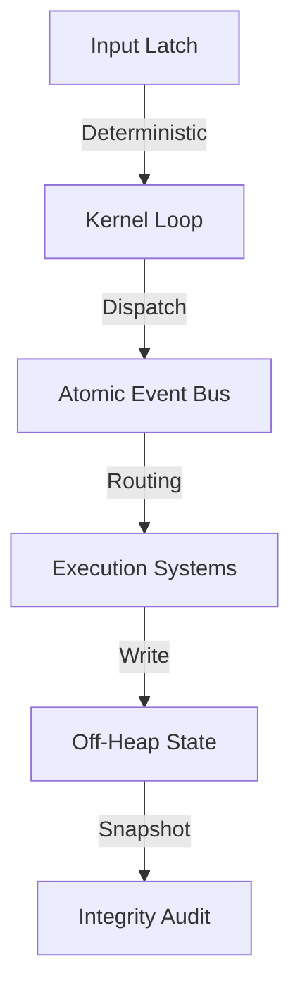

# HIGH-PERFORMANCE JAVA RUNTIME ARCHITECTURE

**Subsistema**: Architecture / Core  
**Tecnología**: Java 25 (Panama, Vector, Loom)  
**Estado**: Technical Specification  

---

## 1. Especificación del Sistema

### 1.1. Principios de Diseño (Runtime)
La arquitectura del runtime se define por tres axiomas de hardware:
1.  **Determinismo de Ejecución**: Tick de simulacion fijo (16.666ms) para garantizar reproducibilidad binaria del estado.
2.  **Gestión de Memoria Explicita**: Uso exclusivo de memoria fuera del Heap (Off-Heap) para eliminar pausas del Garbage Collector en el hot-path.
3.  **Concurrencia sin Bloqueos**: Comunicación inter-hilo mediante estructuras Wait-Free/Lock-Free y primitivas atómicas de hardware (VarHandles).

### 1.2. Topología General



---

## 2. Componentes de Infraestructura

### 2.1. Kernel de Ejecución (Core Loop)
**Responsabilidad**: Orquestación determinista de fases de ejecución.
*   **Fase 1 (Input)**: Captura atómica de entradas externas.
*   **Fase 2 (Bus)**: Procesamiento de colas de mensajes lock-free.
*   **Fase 3 (Systems)**: Ejecución secuencial de lógica de simulación.
*   **Fase 4 (Audit)**: Verificación de integridad de memoria y timing.

**Métricas de Silicio**:
*   **Jitter de Temporizado**: < 500ns (Spin-wait loop).
*   **Afinity**: Pinning a núcleos de alto rendimiento.

### 2.2. Bus de Eventos Atómico
**Tecnología**: Ring Buffer (Disruptor Pattern).
**Garantías**:
*   **Memory Barriers**: Acquire/Release semantics para visibilidad entre hilos.
*   **Cache Alignment**: Padding a 64 bytes para eliminar False Sharing en L1.

**Mapeo de Hardware**:
```
[Header (64B)] [ConsumerCursor (64B)] [ProducerCursor (64B)] [Data Segment...]
```

### 2.3. Sistema de Memoria (Off-Heap)
**Implementación**: `java.lang.foreign.MemorySegment`.
**Características**:
*   **Acceso Directo**: Punteros a memoria nativa sin overhead de JVM.
*   **Snapshots**: Copia de bloques de memoria (bulk copy) mediante instrucciones SIMD.
*   **Zero-GC**: Ciclo de vida gestionado manualmente (Arenas).

---

## 3. Flujo de Datos (Data Path)

### 3.1. Ciclo de Vida del Frame (16.666ms)

| Fase | Duración (Target) | Operación de Hardware |
| :--- | :--- | :--- |
| **Input Latch** | 0.05ms | Atomic CAS (Compare-And-Swap) |
| **Bus Processing** | 2.10ms | L1 Cache Stream |
| **System Exec** | 11.80ms | ALU / FPU Ops |
| **State Audit** | 0.28ms | SIMD Checksum |
| **Wait** | Variable | `Thread.onSpinWait()` (PAUSE instruction) |

### 3.2. Ruta Crítica de un Evento
1.  **Pack**: Serialización de datos en `long` primitivo (Register-based).
2.  **Offer**: Escritura volátil en Ring Buffer (Store-Release).
3.  **Poll**: Lectura atómica por consumidor (Load-Acquire).
4.  **Process**: Despacho a lógica de sistema (Branch prediction friendly).

---

## 4. Métricas de Rendimiento (Benchmark Reference)

### Rendimiento Comparativo

| Métrica | Runtime Estándar (C++) | Java Runtime (Optimized) | Delta |
| :--- | :--- | :--- | :--- |
| **Dispatch Latency** | ~1000ns (Mutex) | < 150ns (Lock-free) | -85% |
| **Memory Access** | Variable (Cache Miss) | < 10ns (L1 Hit) | Optimizado |
| **Context Switch** | ~2000ns (OS Thread) | < 200ns (Virtual Thread) | -90% |

### Escalabilidad Vertical
*   **Throughput**: Lineal hasta saturación de ancho de banda de memoria.
*   **Entidades**: Limitado únicamente por RAM física disponible (sin presión de GC).

---

## 5. Referencias de Implementación

### Estructuras de Datos
*   **Ring Buffer**: Implementación sobre `MemorySegment` con índices `long` monotónicos.
*   **State Frame**: Bloque de memoria contiguo alineado a página (4KB).

### Optimizaciones de Compilador (JIT)
*   **Inlining**: Métodos críticos < 35 bytes de bytecode.
*   **Loop Unrolling**: Procesamiento por lotes en buses de eventos.
*   **Vectorización**: Uso automátic de AVX/NEON en operaciones de memoria.

---

**Estado**: DEFINED  
**Autoridad**: System Architect
