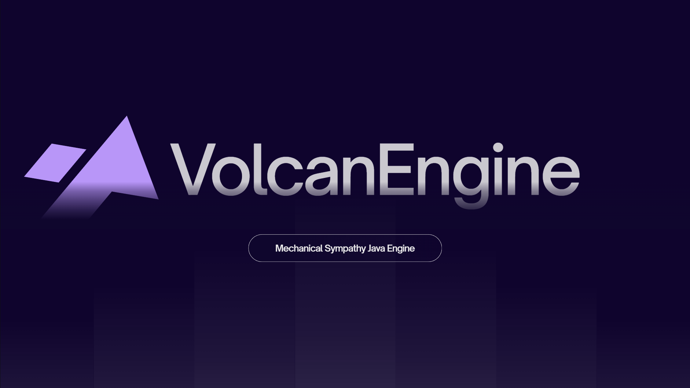

# PITCH DECK: COPA MUNDIAL DE EMPRENDIMIENTO 2026

**Proyecto:** VolcanEngine
**Categoria:** Idea
**Tiempo limite:** 5 Minutos Exactos (Aprox. 600 - 700 palabras habladas)
**Objetivo:** Convencer a los jueces de que VolcanEngine es una startup "Deep Tech" altamente escalable con un modelo de negocios solido.

---

## ESTRUCTURA DE LA PRESENTACION (Las 4 P's)

### 1. PERSONAS (1 Minuto)

## _Diapositiva 1: Tu nombre, el logo de VolcanEngine, tagline: "The First Zero-Overhead, Mechanical Sympathy Java Engine"._

"Buenos días. Soy Marvin Flores. Estudié Ingeniería en Sistemas y Administración de Empresas, dos carreras que no logré terminar por falta de recursos al vivir solo. Hoy en día, después de mi jornada laboral como auxiliar de bodega, soy desarrollador autodidacta. La computadora con la que construí esto es una i5 de 7ma generación, con 8 de RAM y una gráfica vieja de 2 gigas. Todo empezó cuando comencé a notar que algo estaba fundamentalmente mal en cómo se escribe el software actualmente. Una ineficiencia llevaba a otra, una pregunta llevaba a la siguiente, y ese proceso de descubrimiento me llevó cada vez más profundo — hasta llegar a los principios que Martin Thompson llama 'Simpatía Mecánica': la idea de que el software solo alcanza su máximo potencial cuando el desarrollador comprende físicamente cómo opera el hardware que lo ejecuta. Cómo fluye la información por la memoria, cómo trabaja la caché del procesador, cómo se comunican los núcleos entre sí. En ese camino, me di cuenta de que la ineficiencia es amiga de la programación tradicional, y decidí cambiarlo."

### 2. PRODUCTO (1.5 Minutos)

## _Diapositiva 2: El efecto domino — RAM saturada, GC Pause, GPU hambrienta — vs. VolcanEngine._

"La industria tecnologica actual atraviesa una crisis de software perezoso e ineficiente. La norma es apilar capas y capas de abstraccion que aislan al desarrollador del procesador. El abuso de la Programacion Orientada a Objetos fragmenta la memoria, dispersando el estado del programa en miles de objetos esparcidos que destrozan la eficiencia de la cache del CPU. Y aqui ocurre el efecto domino estructural: si saturas la RAM con miles de objetos basura, obligas al procesador a detenerse para limpiarlos — eso son los GC Pauses. Mientras el procesador esta parado limpiando, la GPU se queda hambrienta de datos. El sistema colapsa. Y el usuario sale a comprar hardware nuevo que no deberia necesitar. Las RAM estan caras y reservadas, las graficas modernas estan todavia mas caras. Las computadoras modernas estan todavia mas caras. Las computadoras mas modernas para correr IAs locales estan extremadamente mas caras. Y ni hablar de los servidores. El software ineficiente es el responsable de ese costo.

He aqui la paradoja del software: utilizamos Java — un lenguaje que el mundo asocia a maquinas virtuales pesadas y latencias impredecibles — para hacer exactamente lo contrario. Operamos completamente fuera de la memoria administrada. El estado del motor no existe como objetos Java tradicionales: vive directamente en la memoria RAM nativa mediante Project Panama. El recolector de basura jamas se activa. No hay paradas. No hay efecto domino.

"VolcanEngine es un Motor Orquestador de Ultra-Bajo Nivel escrito en Java que opera a la velocidad de C++. Toma datos masivos, los comprime a nivel de bits, los dispara por un Bus a más de 706 Millones ops/s, organiza el trabajo con un DAG para evitar cuellos de botella, escala dinámicamente desde los 4 núcleos de mi computadora hasta 1024 Workers en un servidor empresarial, resuelve la matemática usando los registros físicos del procesador (SIMD).

Y hace todo esto garantizando Integridad Transaccional: no pierde ni corrompe un solo paquete de datos, incluso bajo estrés máximo.

Un modelo de IA es tan bueno como los datos que recibe pasa exactamente igual con una computadora un servidor. VolcanEngine garantiza que el software reciba caudales masivos de información en tiempo real, sin perder un solo bit." "

### 3. POTENCIAL Y ESCALABILIDAD (1.5 Minutos)

## _Diapositiva 3: Los 4 pilares tecnicos + mercado de desarrolladores global._

"Nuestro mercado son los desarrolladores y empresas de software que necesitan rendimiento determinista — y ese mercado es global.

VolcanEngine no logra estos resultados por accidente. Esta construido sobre cuatro pilares de ingenieria que no existen combinados en ningun otro producto Java del mercado.

**Primero**, Zero-Garbage Collector: todo el estado del motor vive en memoria nativa fuera del heap, el GC jamas se activa.

**Segundo**, estructuras Lock-Free: la comunicacion entre sistemas fluye por buses atomicos de tipo RingBuffer — ningun hilo bloquea a otro.

**Tercero**, alineacion de cache L1: los datos se almacenan en bloques de exactamente 64 bytes para prevenir el fenomeno de False Sharing que destruye la eficiencia entre nucleos del procesador.

**Cuarto**, matematicas SIMD vectorizadas: los calculos masivos se procesan simultaneamente en la CPU usando los registros anchos AVX-512, sin saturar el hardware del usuario.

Los principios que hacen funcionar VolcanEngine son los mismos que Martin Thompson aplico al construir el sistema de trading mas rapido del mundo — los mismos que hoy usan los sistemas financieros de alta frecuencia. Nosotros demostramos que eso se puede construir en Java 25, con seguridad de memoria absoluta.

Nuestra ventaja competitiva es unica: la industria te obliga a elegir entre Java — seguro pero lento — o C++ — rapido pero peligroso, con errores de memoria que cuestan millones en produccion. VolcanEngine usa el ecosistema moderno de Java 25 para obtener velocidad nativa de C++ sin sus riesgos. Esa combinacion no existe en otro producto."

### 4. PREVISIBILIDAD / MODELO DE NEGOCIO (1 Minuto)

## _Diapositiva 4: Modelo de Licencia Dual ($1/año Indie vs Licencia Comercial)._

"Al ser tecnologia de software puro, nuestra escalabilidad global es inmediata. Sin fabricas, sin logistica, sin inventario.

Nuestro modelo de negocio es una Licencia Dual diseñada para penetracion masiva de mercado. Para desarrolladores y startups que facturen menos de $100,000 al año, la licencia cuesta $1 dolar al año. Este precio no es caridad — es estrategia. Con decenas de miles de usuarios de un dolar construimos el ecosistema, la comunidad y los casos de uso reales que los clientes corporativos necesitan ver antes de firmar un contrato.

Para corporaciones y equipos que integren VolcanEngine en entornos de produccion, aplicamos la Licencia Comercial mediante contratos directos.

VolcanEngine no es solo una idea. Es un motor funcional, construido desde cero en El Salvador, validado internamente con 21 pruebas de estres al 100%, listo para demostrar que el alto rendimiento no es exclusivo de los grandes laboratorios del mundo.

## **Muchas gracias.**

---

## CONSEJOS PARA EL PITCH:

- **Ensaya con cronometro:** Este guion a velocidad normal dura unos 4 minutos 40 segundos. Tienes margen.
- **El efecto domino en P2 es visual:** Cuando lo digas, baja el ritmo en cada paso — "RAM saturada... procesador parado... GPU hambrienta... el sistema colapsa." Deja que el juez lo sienta.
- **Las metricas las dices con autoridad, no con entusiasmo:** No son sorpresas, son hechos. "335 megabytes. 29 nanosegundos. 552 millones de operaciones por segundo." Punto.
- **La respuesta a "Por que Java si C++ es el estandar?":** "Porque C++ tiene un costo oculto que las empresas pagan en produccion: los errores de memoria generan vulnerabilidades de seguridad y tiempo de desarrollo que valen millones. Con Project Panama en Java 25, igualamos la velocidad de C++ sin esos riesgos. Eso reduce el costo de desarrollo a la mitad."
- **La respuesta a "Esto no es un motor de videojuegos?":** "La simulacion y los videojuegos son el entorno de validacion mas exigente que existe — el mismo estandar de latencia que exige un sistema financiero. Es nuestro banco de pruebas. El producto es el motor de orquestacion."
