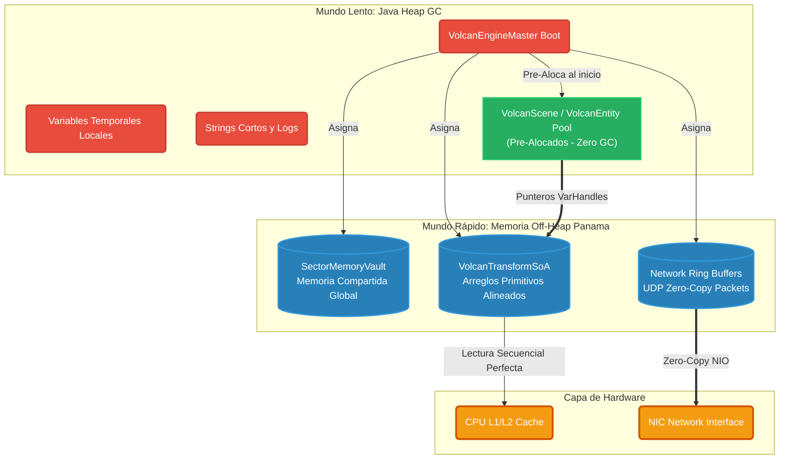

# 🗺️ Mapa del Flujo de Memoria Zero-GC (Capa 1: Cimientos)

Este mapa arquitectónico documenta la filosofía de memoria estricta de VolcanEngine (Headless Backend). Para evitar micro-pausas (stutters) producidas por el Recolector de Basura (Garbage Collector) de la JVM, el motor secuestra bloques directos de RAM (Off-Heap) utilizando Project Panama (`MemorySegment`, `Arena`).

## Leyenda Técnica:
*   **SectorMemoryVault:** El cofre central del estado de la simulación. No guarda objetos Java (`new Object()`), guarda variables atómicas primitivas en memoria nativa C-like.
*   **Network Ring Buffers:** Lee paquetes UDP directos de la tarjeta de red (NIC) a la memoria Off-Heap y los dispara al bus de eventos sin crear objetos temporales (Zero-Copy NIO).
*   **VolcanScene / VolcanEntity Pool:** El orquestador y los envoltorios (Wrappers) Orientados a Objetos. Nacen en el Java Heap, pero se *pre-alocan* 100% en el Boot, burlando al GC. Leen/Escriben al SoA crudo usando punteros hiper-rápidos (`VarHandles`).
*   **Zero-GC:** Durante el tick loop de servidor, la cantidad de memoria asignada en el Heap de Java debe ser exactamente cero (`0 bytes/tick`). Todo ocurre en el bloque `Off-Heap` o reciclando la *Pool* pre-asignada.
