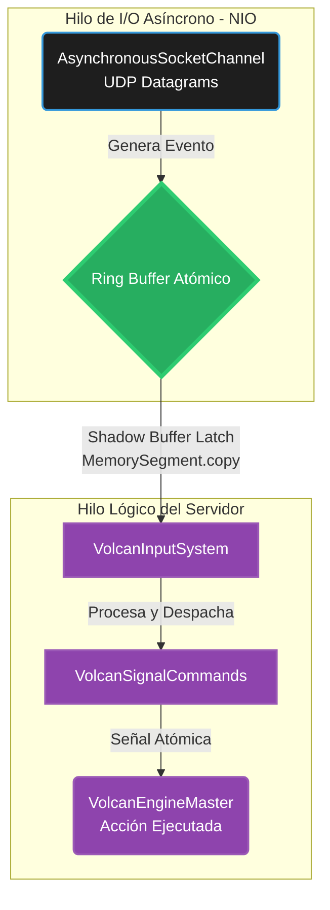

# 🗺️ Mapa del Bus de Entrada Atómico (Capa 2: Orquestación Network)

Para garantizar que el motor (Server Backend) nunca pierda la llegada de un paquete UDP de un cliente conectado, el sistema de ingesta debe ser Lock-Free (sin cerrojos). Si la tarjeta de red (NIC) notifica un paquete mientras el motor está procesando físicas, bloquear el hilo principal causaría *stuttering* masivo a todos los clientes.

Por eso, VolcanEngine utiliza un Bus de Señales de Red implementado con operaciones atómicas (`AtomicInteger`, `VarHandle`).

## Leyenda Técnica:
*   **Ring Buffer Atómico (Memory Visibility):** Un arreglo circular en memoria que permite a un hilo escribir (Network NIO) y a otro leer (Simulación) al mismo tiempo sin colisionar ni trabarse. Funciona bajo el principio de semántica de memoria *Volatile*. Todo el acceso al arreglo se gestiona explícitamente mediante *Memory Fences* usando `VarHandle.setRelease` y `getAcquire`, aniquilando las condiciones de carrera (Data Races) o lecturas fantasma.
*   **AsynchronousSocketChannel:** El canal NIO de Java que Windows/Linux dispara instantáneamente (a través de epoll/IOCP) cada vez que el servidor recibe una trama de red.
*   **Shadow Buffer Latch:** El hilo central copia masivamente (vía SIMD Vectorizado `MemorySegment.copy`) el estado del buffer directamente a Off-Heap. Evita todo bloqueo (Zero-Contention) contra los hilos del OS que procesan la red.
